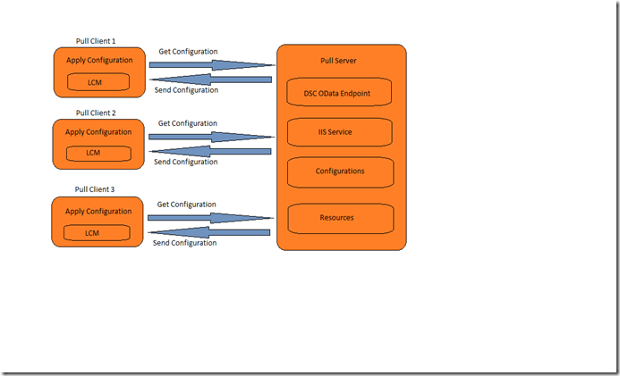

# Adopter des configurations

>S’applique à : Windows PowerShell 4.0, Windows PowerShell 5.0

Il existe deux façons d’appliquer les configurations PowerShell souhaité état Configuration (DSC) : push mode et le mode d’extraction.

## En mode push

En mode push fait référence à un utilisateur d’application d’une configuration activement à un noeud cible en appelant l’applet de commande [Start-DscConfiguration](https://technet.microsoft.com/en-us/library/dn521623.aspx) .

Après la création et la compilation d’une configuration, vous pouvez l’appliquer en mode push en appelant l’applet de commande [Start-DscConfiguration](https://technet.microsoft.com/en-us/library/dn521623.aspx) , en définissant le chemin d’accès au paramètre - de l’applet de commande pour le chemin d’accès où se trouve la configuration MOF. Par exemple, si la configuration de la structure MOF est locted à `C:\DSC\Configurations\localhost.mof`, vous le feriez s’appliquent sur l’ordinateur local avec la commande suivante :
`Start-DscConfiguration -Path 'C:\DSC\Configurations'`

> __Remarque__: par défaut, DSC exécute une configuration en tant que tâche d’arrière-plan. Pour exécuter la configuration de manière interactive, appelez le [DscConfiguration-démarrer](https://technet.microsoft.com/en-us/library/dn521623.aspx) avec la __-attente__ paramètre.

## Mode Pull
 en mode pull, clients de type pull sont configurés pour obtenir leurs configurations de l’état souhaité d’un serveur distant pull. De même, le serveur extrait a été configuré au service de l’hôte du DSC et a été mis en service avec les configurations et les ressources qui sont requis par les clients de type pull.
Chacun des clients de type pull offre une tâche planifiée qui effectue une vérification de la conformité à intervalles réguliers sur la configuration du nœud. Lorsque l’événement est déclenché à la première fois, il provoque le Gestionnaire de Configuration Local (LCM) sur le client d’extraction pour valider la configuration. Si le client d’extraction est configuré comme vous le souhaitez, rien ne se produit. Dans le cas contraire, le LCM effectue une demande au serveur pour obtenir une configuration donnée pull. Si cette configuration existe sur un serveur collecteur et elle transmet les vérifications de validation initiale, la configuration est transmise au client pull, où elle est ensuite exécutée par la méthode LCM.

Les rubriques suivantes expliquent comment configurer les clients et les serveurs de type pull :

- [Configuration d’un serveur de type pull web](pullServer.md)
- [Configuration d’un serveur de type pull SMB](pullServerSMB.md)
- [Configuration d’un client de l’extraction](pullClientConfigID.md)