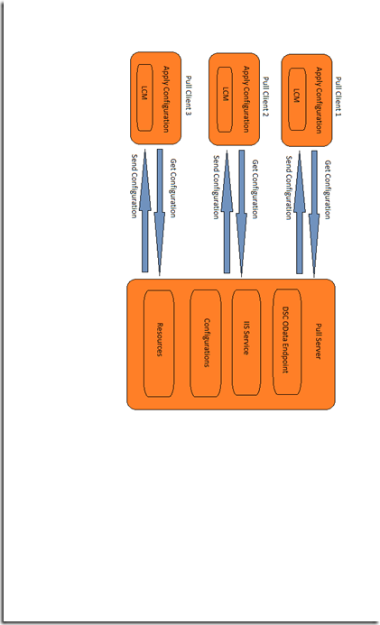

# Configurations partielles PowerShell souhaité état Configuration dépendance de Test

>S’applique à : Windows PowerShell 5.0

Dans 5.0 PowerShell, vous le souhaitez état Configuration (DSC) permet de configurations à livrer dans fragments et à partir de plusieurs sources. Le Gestionnaire de Configuration Local (PPCM) sur le nœud cible réunit les fragments avant de les appliquer comme une configuration unique. Cette fonctionnalité permet de partager le contrôle de configuration entre des personnes ou équipes. Par exemple, si deux ou plusieurs équipes de développeurs collaborez sur un service, ils chacun à créer des configurations pour gérer leur partie du service. Chacune de ces configurations peut être transférée à partir de serveurs extraire différentes, et ils peuvent être ajoutés au différentes phases de développement. Configurations partielles permettent également différents utilisateurs ou équipes contrôler les différents aspects de la configuration des nœuds sans avoir à coordonner la modification d’un document de configuration unique. Par exemple, une équipe peut être responsable du déploiement une machine virtuelle et le système d’exploitation, tandis que d’une autre équipe peut-être déployer des autres applications et services sur cet ordinateur virtuel. Avec les configurations partielles, chaque équipe peut créer sa propre configuration, sans un d’eux étant inutilement complexes.

Vous pouvez utiliser des configurations partielles en mode « pousser », extraire mode ou une combinaison des deux.

## Configurations partielles en mode « pousser »
Pour utiliser des configurations partielles en mode push, vous configurez le PPCM sur le nœud cible à recevoir les configurations partielles. Chaque configuration partielle doit être transférée vers la cible à l’aide de l’applet de commande Publier DSCConfiguration. Le nœud cible combine alors la configuration partielle dans une configuration unique, et vous pouvez appliquer la configuration en appelant l’applet de commande [Démarrer DscConfigurationxt](https://technet.microsoft.com/en-us/library/dn521623.aspx) .

### Configuration de la PPCM configurations partielle mode « pousser »
Pour configurer le PPCM configurations partielle en mode push, vous créez une configuration **DSCLocalConfigurationManager** avec un bloc de **PartialConfiguration** pour chaque configuration partielle. Pour plus d’informations sur la configuration de la PPCM, voir [configuration du Gestionnaire de Configuration Local de Windows](https://technet.microsoft.com/en-us/library/mt421188.aspx). L’exemple suivant montre une configuration PPCM qui attend deux configurations partielles — qui déploie le système d’exploitation et celui qui est déployée et configure SharePoint.

```powershell
[DSCLocalConfigurationManager()]
configuration PartialConfigDemo
{
    Node localhost
    {
        
           PartialConfiguration OSInstall
        {
            Description = 'Configuration for the Base OS'
            RefreshMode = 'Push'
        }
           PartialConfiguration SharePointConfig
        {
            Description = 'Configuration for the SharePoint server'
            RefreshMode = 'Push'
        }
    }
}
PartialConfigDemo 
```

**RefreshMode** pour chaque configuration partielle est défini sur « Push ». Les noms des blocs **PartialConfiguration** (dans ce cas, « OSInstall » et « SharePointConfig ») doivent correspondre exactement aux noms des configurations qui sont déplacées vers le nœud cible.

### Publication et démarrage configurations partielle mode « pousser »


Vous appelez puis **Publier DSCConfiguration** pour chaque configuration, en passant les dossiers qui contiennent les documents de configuration en tant que les paramètres de chemin d’accès. Une fois les deux configurations de publication, vous pouvez appeler `Start-DSCConfiguration –UseExisting` sur le nœud cible.

## Configurations partielles en mode d’extraction

Configurations partielles peuvent être extraits d’un ou plusieurs serveurs d’extraction (pour plus d’informations sur les serveurs extraire, voir [Windows PowerShell vous le souhaitez Configuration extraire serveurs d’état](pullServer.md). Pour ce faire, vous devez configurer la PPCM sur le nœud cible à extraire les configurations partielles, puis nommez et localiser les documents de configuration correctement sur les serveurs extraire.

### Configuration de la PPCM pour les configurations de nœud extraire

Pour configurer le PPCM pour extraire les configurations partielles à partir d’un serveur d’extraction, vous définissez le serveur extraire dans un **ConfigurationRepositoryWeb** (pour un serveur d’extraire HTTP) ou un bloc de **ConfigurationRepositoryShare** (pour un serveur d’extraire PME). Vous créez puis blocs **PartialConfiguration** qui font référence au serveur extraire à l’aide de la propriété **ConfigurationSource** . Vous devez également créer un bloc de paramètres pour indiquer que la PPCM utilise le mode d’extraction et de spécifier l’Id_de_configuration le serveur extraire et du nœud cible permet d’identifier les configurations. La configuration de métadonnées suivante définit un serveur extraire HTTP nommé CONTOSO-PullSrv et deux configurations partielles qui utilisent qui Tirez server.

```powershell
[DSCLocalConfigurationManager()]
configuration PartialConfigDemo
{
    Node localhost
    {
        Settings
        {
            RefreshMode = 'Pull'
            ConfigurationID = '1d545e3b-60c3-47a0-bf65-5afc05182fd0'
            RefreshFrequencyMins = 30 
            RebootNodeIfNeeded = $true
        }
        ConfigurationRepositoryWeb CONTOSO-PullSrv
        {
            ServerURL = 'https://CONTOSO-PullSrv:8080/PSDSCPullServer.svc'
            
        }
        
           PartialConfiguration OSInstall
        {
            Description = 'Configuration for the Base OS'
            ConfigurationSource = '[ConfigurationRepositoryWeb]CONTOSO-PullSrv'
            RefreshMode = 'Pull'
        }
           PartialConfiguration SharePointConfig
        {
            Description = 'Configuration for the Sharepoint Server'
            ConfigurationSource = '[ConfigurationRepositoryWeb]CONTOSO-PullSrv'
            DependsOn = [PartialConfiguration]OSInstall
            RefreshMode = 'Pull'
        }
    }
}
PartialConfigDemo 
```

Vous pouvez l’extraire partielles configurations à partir de plusieurs server extraire, vous devrez simplement définir chaque serveur extraire, puis reportez-vous au serveur extraire approprié dans chaque bloc PartialConfiguration.

Après avoir créé la configuration de métadonnées, vous devez exécuter dessus pour créer un document de configuration (un fichier MOF), puis appelez [Set-DscLocalConfigurationManager](https://technet.microsoft.com/en-us/library/dn521621(v=wps.630).aspx) pour configurer le PPCM.

### Façon de nommer et placer les documents de configuration sur le serveur extraire

Les documents de configuration partielle doivent être placés dans le dossier spécifié en tant que **ConfigurationPath** dans les `web.config` fichier pour le serveur extraire (généralement `C:\Program Files\WindowsPowerShell\DscService\Configuration`). Les documents de configuration doivent être nommés comme suit : _nom de configuration_. _Id_de_configuration_`.mof`, où _nom de configuration_ est le nom de la configuration partielle et _Id_de_configuration_ est l’ID de configuration défini dans le PPCM sur le nœud cible. Dans notre exemple, les documents de configuration doivent être noms comme suit.


### Exécution des configurations partielles à partir d’un serveur d’extraction

Après la PPCM sur le nœud cible a été configurée, et les documents de configuration ont été créés et correctement nommées sur le serveur extraire, le nœud cible extraire les configurations partielles, les combiner et appliquer la configuration obtenue à intervalles réguliers comme spécifié par la propriété **RefreshFrequencyMins** de la PPCM. Si vous voulez qu’une actualisation, vous pouvez appeler l’applet de commande de mise à jour DscConfiguration pour extraire les configurations, puis `Start-DSCConfiguration –UseExisting` les appliquer.

## Configurations partielles dans les modes extraits et mixtes

Vous pouvez également mélanger push modes extraction et configurations partielle. En d’autres termes, vous pouvez avoir une configuration partielle extraites d’un serveur extraire, tandis que vous appuyez sur une autre configuration partielle. Considérer chaque configuration partielle comme vous le feriez, selon le mode d’actualisation comme décrit dans les sections précédentes. Par exemple, la configuration de métadonnées suivante décrit le même exemple, avec le système d’exploitation partielle configuration en mode d’extraction et la configuration de partielle SharePoint en mode « pousser ».

```powershell
[DSCLocalConfigurationManager()]
configuration PartialConfigDemo
{
    Node localhost
    {
        Settings
        {
            RefreshMode = 'Pull'
            ConfigurationID = '1d545e3b-60c3-47a0-bf65-5afc05182fd0'
            RefreshFrequencyMins = 30 
            RebootNodeIfNeeded = $true
        }
        ConfigurationRepositoryWeb CONTOSO-PullSrv
        {
            ServerURL = 'https://CONTOSO-PullSrv:8080/PSDSCPullServer.svc'
            
        }
        
           PartialConfiguration OSInstall
        {
            Description = 'Configuration for the Base OS'
            ConfigurationSource = '[ConfigurationRepositoryWeb]CONTOSO-PullSrv'
            RefreshMode = 'Pull'
        }
           PartialConfiguration SharePointConfig
        {
            Description = 'Configuration for the Sharepoint Server'
            DependsOn = [PartialConfiguration]OSInstall
            RefreshMode = 'Push'
        }
    }
}
PartialConfigDemo 
```

Notez que la **RefreshMode** spécifié dans le bloc de paramètres est « Extraire », mais **RefreshMode** pour la configuration partielle OSInstall est « Push ».

Vous nommez et localiser les documents de configuration comme décrit ci-dessus pour leurs modes d’actualisation respectives. Vous pouvez appeler **DSCConfiguration de publier** pour publier la configuration partielle SharePointInstall et soit attendre la configuration OSInstall à collecter à partir du serveur extraire ou forcer une actualisation en appelant [DscConfiguration de mise à jour](https://technet.microsoft.com/en-us/library/mt143541(v=wps.630).aspx).

##Voir aussi 

**Concepts**
[de Configuration Windows PowerShell que vous le souhaitez l’état d’extraire des serveurs](pullServer.md) 
[Windows Configuration du Gestionnaire de Configuration Local](https://technet.microsoft.com/en-us/library/mt421188.aspx) 
